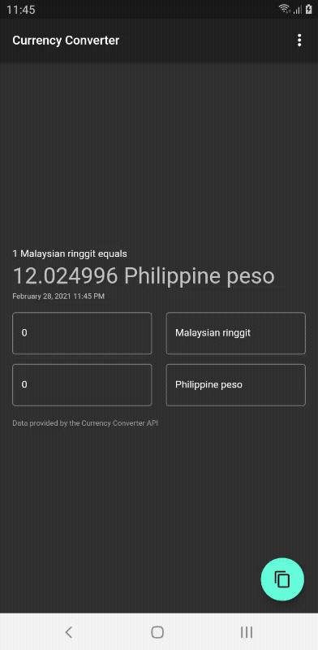

# currency_converter

Yet another currency converter. For my mobile application assignment.

## Dependencies

- Free Currency Converter API - [Link](https://free.currencyconverterapi.com/)
- Riverpod - [Flutter Hooks](https://pub.dev/packages/flutter_hooks) + [Hooks Riverpod](https://pub.dev/packages/hooks_riverpod)
- Shared preferences - [Link](https://pub.dev/packages/shared_preferences)
- flutter_dotenv - [Link](https://pub.dev/packages/flutter_dotenv)
- http - [Link](https://pub.dev/packages/http)
- intl - [Link](https://pub.dev/packages/intl)
- url_launcher - [Link](https://pub.dev/packages/url_launcher)
- flutter_speed_dial - [Link](https://pub.dev/packages/flutter_speed_dial)

## Changelog

### 0.1.1

- Initial design

### 0.2.0

- Use Free Currency Converter API
- Add a copy to the clipboard function
- Add about this dialog
- Add change theme function
- Center the design for easy navigation
- Show the time when is the currency requested
- Add swap function when two currency are the same

## Preview

