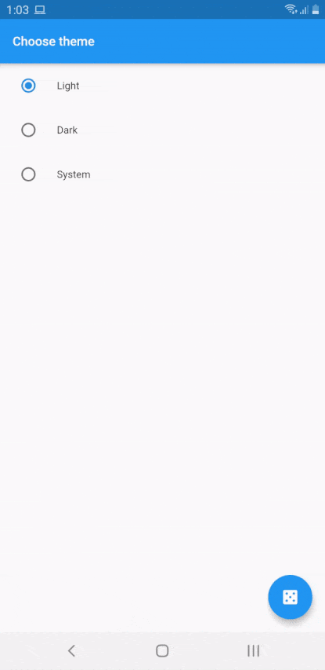

# theme_state

A Flutter application that can change its themes dynamically using Riverpod and Shared preferences.

## Dependencies

- Riverpod - [Flutter Hooks](https://pub.dev/packages/flutter_hooks) + [Hooks Riverpod](https://pub.dev/packages/hooks_riverpod)
- Shared preferences - [Link](https://pub.dev/packages/shared_preferences)

## Changelog

### 0.1.4

- Use ThemeData.light() and ThemeData.dark()
- Refactor codes

### 0.1.3

- Use ThemeMode.value[int]

### 0.1.2

- Use Riverpod AsynValue
- Use Shared preferences

## APK

- [Download here](app-release.apk)

## Preview

